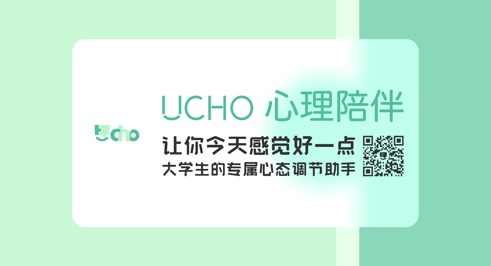
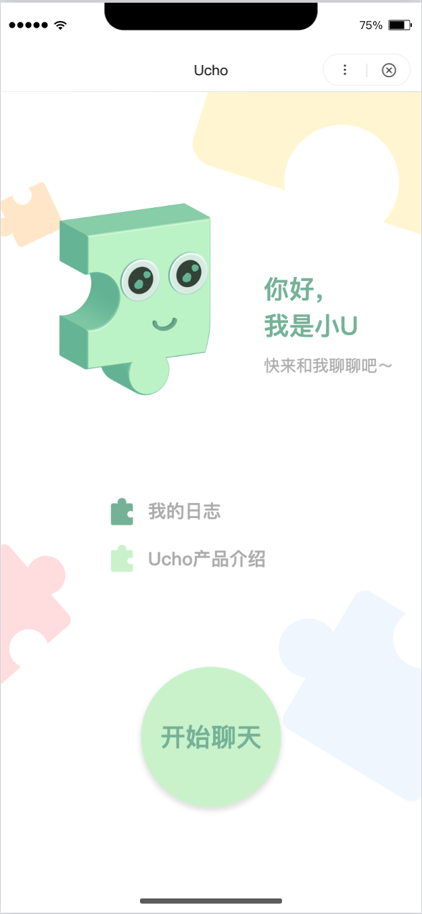
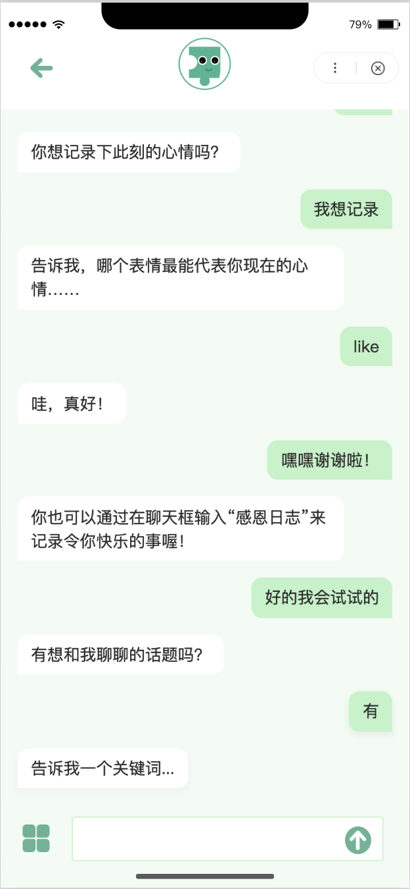
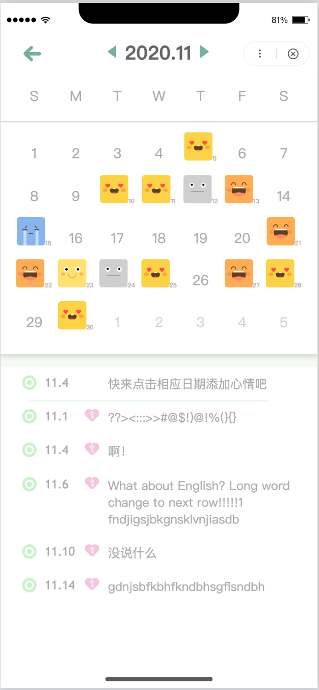
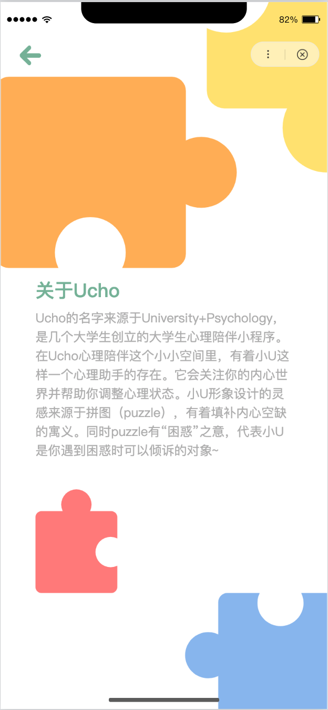

# Ucho

## Support Ucho

## 产品简介

- Why Ucho?

  来源于**U**niversity + Psy**cho**logy, 面向大学生开发的心理陪伴百度小程序。

  在Ucho心理陪伴这个小小空间里，有着小U这样一个机器人的存在。小U最初是来源于身边朋友的一句话——“有些心情可能宁愿和机器人说，也没法跟别人倾诉。”于是，一个关注大学生内心世界的机器人朋友就此诞生了。

- 小U想做什么？

  小U是一款帮助存在短暂情绪/心理困扰的大学生群体调整内心状态的心理小程序。

  具体来说：

  小U会陪伴你记录你每天的心情，让你关注自己内心的情绪和心理状态；

  小U会听你倾诉遇到的负面情绪，然后帮助你走出情绪的阴影；

  小U 还会跟你聊聊最近你高兴的事，让快乐的回忆感染你当下的情绪……

  小U想做的事情其实很简单：让你的每一天都感觉好一点。

## 产品界面

## 功能

- **聊天心理助手：**和用户聊天，用心理学方法帮助用户调节心理状态

  - 感恩日志：引导用户回忆快乐和值得感恩的事情，给当下情绪注入积极的能量    

  - 合理书写：引导用户客观化书写与负面情绪的相关事实，帮助用户从情绪阴影中走出来

- **心情日历：**帮助记录每天的心情，关注内心变化是调节心理状态的第一步

TODO… 